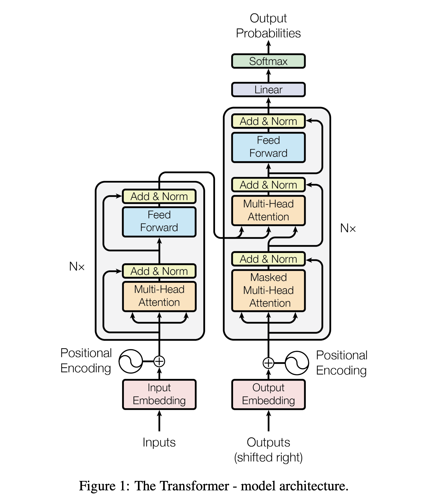

# Character Level Large Language Models

Following "Neural Networks: Zero to Hero" by Andrej Kapathy ([@karpathy](https://github.com/karpathy))

- [YouTube Tutorial](https://www.youtube.com/playlist?list=PLAqhIrjkxbuWI23v9cThsA9GvCAUhRvKZ)
- GitHub Repositories:
  - [makemore](https://github.com/karpathy/makemore)
  - [nanoGPT](https://github.com/karpathy/nanoGPT)


From: [Attention Is All You Need
](https://arxiv.org/abs/1706.03762)

## Implmentations From...

- MLP, following [Bengio et al. 2003](https://www.jmlr.org/papers/volume3/bengio03a/bengio03a.pdf)
- CNN, following [DeepMind WaveNet 2016](https://arxiv.org/abs/1609.03499) (in progress...)
- RNN, following [Mikolov et al. 2010](https://www.fit.vutbr.cz/research/groups/speech/publi/2010/mikolov_interspeech2010_IS100722.pdf)
- LSTM, following [Graves et al. 2014](https://arxiv.org/abs/1308.0850)
- GRU, following [Kyunghyun Cho et al. 2014](https://arxiv.org/abs/1409.1259)
- Transformer, following [Vaswani et al. 2017](https://arxiv.org/abs/1706.03762)


## Makemore Models

> **An autoregressive character-level language models**

- Takes one text file as input, where each line is assumed to be one training thing, and generates more things like it.
- In this case, [data](data/names.txt) is a database of names & models generate cool new names!


1. [Bigram Model](makemore_models/bigram.py)
```
Generated Examples: ['mor.', 'axx.', 'minaymoryles.', 'kondlaisah.', 'anchshizarie.', 'odaren.', 'iaddash.', 'h.', 'jhinatien.', 'egushl.']
Training Loss: 2.4543561935424805
Testing Loss: 3.4195985794067383
Word: josh
.j: prob=0.0756 logprob=-2.5826
jo: prob=0.1640 logprob=-1.8079
os: prob=0.0634 logprob=-2.7578
sh: prob=0.1581 logprob=-1.8444
h.: prob=0.3153 logprob=-1.1542
log_likelihood=tensor(-10.1469)
nll=tensor(10.1469)
normalized_nll=tensor(2.0294)
Word: abcdjq
.a: prob=0.1376 logprob=-1.9835
ab: prob=0.0160 logprob=-4.1363
bc: prob=0.0007 logprob=-7.1974
cd: prob=0.0006 logprob=-7.4841
dj: prob=0.0018 logprob=-6.3141
jq: prob=0.0003 logprob=-7.9817
q.: prob=0.0970 logprob=-2.3331
log_likelihood=tensor(-37.4303)
nll=tensor(37.4303)
normalized_nll=tensor(5.3472)
```
1. [Neural Network Model - v1](makemore_models/nn_v1.py)
```
Epoch 0: Loss 3.758953332901001
Epoch 1: Loss 3.371100664138794
Epoch 2: Loss 3.154043197631836
Epoch 3: Loss 3.020373821258545
Epoch 4: Loss 2.927711248397827
Epoch 5: Loss 2.8604021072387695
Epoch 6: Loss 2.8097290992736816
Epoch 7: Loss 2.7701022624969482
Epoch 8: Loss 2.7380728721618652
Epoch 9: Loss 2.711496591567993
Epoch 10: Loss 2.6890032291412354
Epoch 11: Loss 2.6696884632110596
Epoch 12: Loss 2.65293025970459
Epoch 13: Loss 2.638277292251587
Epoch 14: Loss 2.6253881454467773
Epoch 15: Loss 2.613990545272827
Epoch 16: Loss 2.60386323928833
Epoch 17: Loss 2.5948216915130615
Epoch 18: Loss 2.5867116451263428
Epoch 19: Loss 2.579403877258301
Generated Examples: ['moq.', 'axxaninaynnnykas.', 'kondn.', 'isah.', 'anchunizarie.', 'odaren.', 'iaegerfblallliguomicegxwis.', 'h.', 'av.', 'a.']
Training Loss: 2.572789192199707
Testing Loss: 3.002462387084961
```
1. [Neural Network Model - v2](makemore_models/nn_v2.py)
```
Total Parameters: 11897
      0/ 200000: 27.1911
  10000/ 200000: 2.2490
  20000/ 200000: 2.5724
  30000/ 200000: 2.4509
  40000/ 200000: 2.1374
  50000/ 200000: 2.4703
  60000/ 200000: 2.1571
  70000/ 200000: 2.4489
  80000/ 200000: 2.5287
  90000/ 200000: 2.2128
 100000/ 200000: 2.3358
 110000/ 200000: 2.1692
 120000/ 200000: 2.1493
 130000/ 200000: 1.7323
 140000/ 200000: 2.2502
 150000/ 200000: 2.3654
 160000/ 200000: 2.0955
 170000/ 200000: 1.7022
 180000/ 200000: 2.4705
 190000/ 200000: 2.2818
Train Loss: 2.1259920597076416
Val Loss: 2.1729347705841064
Generated Examples: ['carpa.', 'zamilli.', 'khi.', 'miri.', 'thay.', 'skansh.', 'eja.', 'hube.', 'den.', 'rhe.', 'kaeli.', 'nerania.', 'chaiif.', 'kaleigh.', 'ham.', 'jorn.', 'quinn.', 'shous.', 'alian.', 'quis.']
```
1. [Neural Network Model - v3](makemore_models/nn_v3.py)
```
Total Parameters: 47551
      0/ 200000: 3.2870
  10000/ 200000: 2.3578
  20000/ 200000: 2.1043
  30000/ 200000: 1.9646
  40000/ 200000: 2.2144
  50000/ 200000: 2.2267
  60000/ 200000: 1.7339
  70000/ 200000: 2.1750
  80000/ 200000: 2.1895
  90000/ 200000: 1.8280
 100000/ 200000: 2.3632
 110000/ 200000: 2.2012
 120000/ 200000: 2.1030
 130000/ 200000: 1.8564
 140000/ 200000: 1.8051
 150000/ 200000: 1.9257
 160000/ 200000: 1.8764
 170000/ 200000: 1.8336
 180000/ 200000: 2.2312
 190000/ 200000: 2.0511
Train Loss: 2.010877847671509
Val Loss: 2.0822041034698486
Generated Examples: ['tiavo.', 'deya.', 'brie.', 'araice.', 'isha.', 'roancayse.', 'emreidra.', 'hani.', 'tyleib.', 'chetcalyn.', 'kwistamarin.', 'mara.', 'sole.', 'diottari.', 'lacereaemi.', 'mico.', 'caymona.', 'zaki.', 'leonta.', 'pepp.']
```
1. [Neural Network Model - v4](makemore_models/nn_v4.py)
```
Total Parameters: 76579
      0/ 200000: 3.3089
  10000/ 200000: 1.8268
  20000/ 200000: 1.7980
  30000/ 200000: 1.9491
  40000/ 200000: 2.0487
  50000/ 200000: 2.0088
  60000/ 200000: 2.2462
  70000/ 200000: 1.6711
  80000/ 200000: 1.6818
  90000/ 200000: 2.3227
 100000/ 200000: 2.2765
 110000/ 200000: 1.4424
 120000/ 200000: 1.6375
 130000/ 200000: 2.1063
 140000/ 200000: 1.7828
 150000/ 200000: 1.9999
 160000/ 200000: 1.7877
 170000/ 200000: 1.6707
 180000/ 200000: 2.6358
 190000/ 200000: 1.4886
Train Loss: 1.7871284484863281
Val Loss: 1.9913774728775024
Generated Examples: ['dalyn.', 'ahnia.', 'sofer.', 'jubson.', 'jannie.', 'joss.', 'chanthin.', 'gerapton.', 'mariyael.', 'terry.', 'zyyan.', 'muzyah.', 'suirlyn.', 'branson.', 'reiner.', 'azan.', 'zyann.', 'kasnon.', 'flona.', 'ahavari.']
```

## Nano-GPT Models

> **Medium-sized Decoder-Only Transformer based GPT**

Trained on [Shakespeare text](data/input.txt), to genreate new text similar to it!

1. [Bigram Model](nano_gpt_models/bigram.py)
```
Step:0: train loss 4.7631, val loss 4.7663
Step:1000: train loss 3.7780, val loss 3.7814
Step:2000: train loss 3.1664, val loss 3.1678
Step:3000: train loss 2.8111, val loss 2.8360
Step:4000: train loss 2.6556, val loss 2.6511
Step:5000: train loss 2.5722, val loss 2.5797
Step:6000: train loss 2.5195, val loss 2.5454
Step:7000: train loss 2.4938, val loss 2.5129
Step:8000: train loss 2.4908, val loss 2.5035
Step:9000: train loss 2.4776, val loss 2.4917
---AFTER TRAIN ---


CENGHe' yrenen yoyowhes.
ICESTENGS:
Thy ceroothethy ou t kis ay:
Ant!

When h,Werdl be tof mee d om throoso-plar, lemy be y, d; h ked; mury Ahehitif o th bllican fougrd mavare ionglon strarsusf tesictims d iste, wixa.

F h y tame dyogrin ICoowopedyn baveso melik foucr uecak's thave.'s me.
ININNowiure pare r ad harel S:
3cean'se Mor ct?
Y:
Cl atounyowito me Sincevee tothinoodrdeapat tyee s, were!
```

2. [Bigram + Position Encoding Model](nano_gpt_models/v2.py)
```
Step:0: train loss 4.4878, val loss 4.5028
Step:500: train loss 2.7204, val loss 2.7580
Step:1000: train loss 2.5810, val loss 2.6155
Step:1500: train loss 2.5372, val loss 2.5599
Step:2000: train loss 2.5048, val loss 2.5374
Step:2500: train loss 2.4937, val loss 2.5196
Step:3000: train loss 2.4969, val loss 2.5252
Step:3500: train loss 2.5022, val loss 2.5150
Step:4000: train loss 2.4834, val loss 2.5028
Step:4500: train loss 2.4888, val loss 2.5143
---AFTER TRAIN ---

DEOna youm ble r l oulither k,
OLAMINouy w hel challouthilerrs Pror wos emes as h'dr,
NI it y mawand.
G
'st tele bichinobur we t bo y ber bly, s appay
BELOUKBupe k't d y ING thiss, any ttithe ssste ce, oreal fr-wereaneeatee
Whist yente wis fas. copicy th, bcir iter tind udesced se ESoathe chie
Tiothin st ntr'de Cobler whay iote IUCavot g,
IZNCHINI Proiorby sirkeneres s derer Y:

To t thid cest an.
```

3. [Self-Attention Model](nano_gpt_models/v3.py)
```
Step:0: train loss 4.1879, val loss 4.1867
Step:500: train loss 2.7170, val loss 2.7352
Step:1000: train loss 2.5219, val loss 2.5336
Step:1500: train loss 2.4756, val loss 2.4774
Step:2000: train loss 2.4354, val loss 2.4568
Step:2500: train loss 2.4321, val loss 2.4397
Step:3000: train loss 2.4227, val loss 2.4367
Step:3500: train loss 2.4169, val loss 2.4313
Step:4000: train loss 2.4018, val loss 2.4260
Step:4500: train loss 2.3951, val loss 2.4336
---AFTER TRAIN ---

Sonst.

The myo maly.


I''d spor owutn sew fed sp ste atl Rat.
NCoughe,
Fhete your, adr sehapr?

WINO: his I:
NE:
AR AUS:
ARLUKORA des elyan thetiorove, rdis cred, my, kid!

RGarwearf hes mye mye st hane. Yot.

Hak yill tet,
JI Roun
Wheret ot slle the, irwconcok orck, ca, hesndo athoty an bee, bes a, bes.

Clouts mult wigengd arne st is:
CAnacew mas, ls mus thagh ispur and hasurt her wangs,
thar
```

4. [Multi-Head Attention](nano_gpt_models/v4.py)
```
Step:0: train loss 4.1568, val loss 4.1620
Step:500: train loss 2.6920, val loss 2.7108
Step:1000: train loss 2.5332, val loss 2.5459
Step:1500: train loss 2.4604, val loss 2.4584
Step:2000: train loss 2.4009, val loss 2.4134
Step:2500: train loss 2.3778, val loss 2.3767
Step:3000: train loss 2.3540, val loss 2.3577
Step:3500: train loss 2.3347, val loss 2.3381
Step:4000: train loss 2.3026, val loss 2.3204
Step:4500: train loss 2.2843, val loss 2.3198
---AFTER TRAIN ---

Sonst.

The meth thor Iling, wepny gautn sin forns deve ase Rat.
Naver your, te your, anres,
aprakaith if meard.

MI hill foulf doms de.


San theriom. 'ING:
Tuched, mall id!

RGarwearf he to her!
TULES:
Yof sat bol' yil yourd
Jould his nred oth lae you, ifecchyourdack, catwhesndo athot tay bust be in, I fir ull tay muttely to the ar't my:
CArapew the west usht the is urrand has of her wands,
thar
```

5. [Multi-Head Attention + Feed-Forward Block](nano_gpt_models/v5.py)
```
Step:0: train loss 4.2073, val loss 4.2089
Step:500: train loss 2.6285, val loss 2.6394
Step:1000: train loss 2.4731, val loss 2.4860
Step:1500: train loss 2.4200, val loss 2.4231
Step:2000: train loss 2.3568, val loss 2.3719
Step:2500: train loss 2.3346, val loss 2.3381
Step:3000: train loss 2.3135, val loss 2.3101
Step:3500: train loss 2.2738, val loss 2.2850
Step:4000: train loss 2.2472, val loss 2.2649
Step:4500: train loss 2.2389, val loss 2.2819
---AFTER TRAIN ---

Therenttel? Gwinand eove the meforsotw, fick
Dund thill durn? Loo? inge thy pas to icth rige deadre pre traint of docloow?

Nod fre
Sthe Boag's you cand as wimed.
Huss Joce lo to the loue thursw have with youres.

IU's Burd is pay uld prrist; suthav ous stome nille; to forw?
MIMENSTETTENET:
Wyour wind pem of prmemblefe yo, tre, My to jou thing, door and lit ain thad comevill. I'KH
LUCIO:
Now couly
```

6. [Residual Connection with Transformer Blocks](nano_gpt_models/v6.py)
```
Step:0: train loss 4.4304, val loss 4.4418
Step:500: train loss 2.3703, val loss 2.3839
Step:1000: train loss 2.2673, val loss 2.2893
Step:1500: train loss 2.1940, val loss 2.2164
Step:2000: train loss 2.1318, val loss 2.1828
Step:2500: train loss 2.1246, val loss 2.1494
Step:3000: train loss 2.0942, val loss 2.1401
Step:3500: train loss 2.0634, val loss 2.1253
Step:4000: train loss 2.0292, val loss 2.1276
Step:4500: train loss 2.0239, val loss 2.1092
---AFTER TRAIN ---

AUCESS
EO:
But speers; and bamigh havions guer'ot bear, my face
Aike; his have well dearge, if of the dice, thangock:
Whow mhas of see nate, To mas he make of far, are;
Bedore be's bricege colbels may his the slay:
I his sone. lige macke as suranst birt to fay'd but they canso gravity high this daies and his his my thus my, and hose him: guck: from I note a fors spity so anjoy foreis.

NORIES:
The
```

7. [Residual Connection with Transformer Blocks + LayerNorm](nano_gpt_models/v7.py)
```
Step:0: train loss 4.2909, val loss 4.2965
Step:500: train loss 2.3991, val loss 2.4100
Step:1000: train loss 2.2732, val loss 2.2994
Step:1500: train loss 2.1887, val loss 2.2112
Step:2000: train loss 2.1322, val loss 2.1774
Step:2500: train loss 2.1207, val loss 2.1350
Step:3000: train loss 2.0789, val loss 2.1235
Step:3500: train loss 2.0471, val loss 2.1094
Step:4000: train loss 2.0164, val loss 2.1017
Step:4500: train loss 2.0128, val loss 2.0910
---AFTER TRAIN ---

AUCESCEEO:
But sagers'd me batightherions I magot bear ful face oing; him, may well dear cold book this cust and of If they have is then
I wreas.

VOLOXEN
Fort, have restedor would brichus colbere may his the rake:
Come. O heath no mage, as shranis biet res, my sour they canso gravaty high this daies and his hill Hothus my, and the hath: ghave frive the evay.

CFODWAUMIULAELLINGBEY:
Doot:
I mothin
```